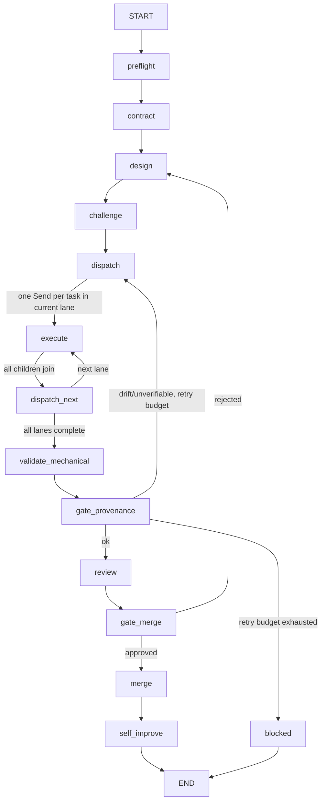

# LangGraph pipeline

The shipped `build_pipeline()` graph is a terminating, checkpointable port of
the Beastmode loop. Gate nodes call `interrupt()` before any side effect; a
resume replays the gate node from the top, so the same `thread_id` is required.

`gate_provenance` never duplicates the shell gate: it calls
`scripts/lib/acn_meta.py` through `beastmode.core.provenance`. Executor nodes
are integration points for subprocess drivers; direct-call judgment seats may
use `SeatModel` only when the provider response proves its serving model.

## Async, retry, and replay

`arun_pipeline` is the async entry point and `run_pipeline` is the synchronous
wrapper. Gate nodes are replay-safe because `interrupt()` is their first
executable statement. Contract, design, dispatch, mechanical validation, and
merge bookkeeping are idempotent state updates; executor drivers must be
idempotent against an existing child directory and must never synthesize a
missing child `meta.json`.

The builder applies a bounded `RetryPolicy` to ordinary nodes and a one-attempt
policy to the load-bearing gates. Use `checkpoint_history` to list durable
snapshots and `replay_from_checkpoint` to replay a selected snapshot on the
same goal thread. `SqliteSaver` is the local default; PostgreSQL is opt-in.

`stream_mode="custom"` emits phase, gate, and executor stdout/stderr events.
Trace records are optional and vendor-neutral; they never decide whether a
provenance gate passes.
